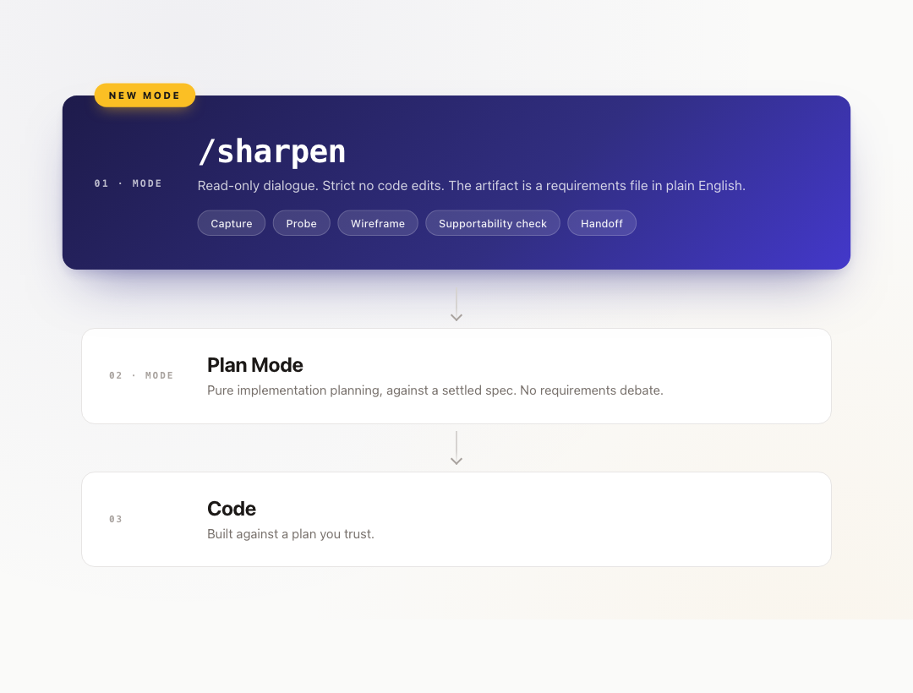
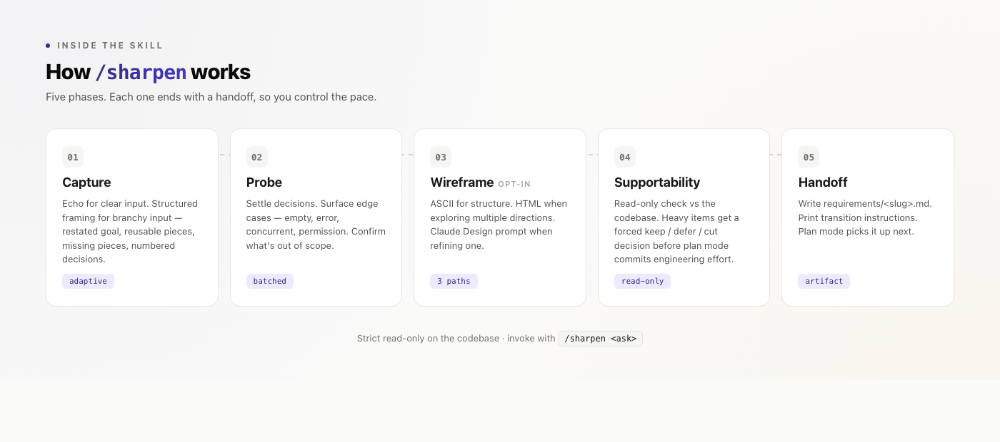

# /sharpen

**Current version: 1.1** — see [Changelog](#changelog).

A new mode for [Claude Code](https://claude.com/claude-code): concept planning that runs before plan mode.



A read-only dialogue mode that sits between "rough idea" and plan mode. The goal: by the time `/sharpen` exits, the requirements are specific enough that plan mode is purely about implementation, not about understanding what you want.

Strict read-only on the codebase. The only writable targets are `requirements/<slug>.md` and any wireframe files it produces alongside it.



## When to use

- Branchy feedback or feature asks with embedded examples and "even better would be" extensions.
- "Don't implement yet — let's nail down the requirements first."
- Mid-flow design questions you'd rather settle in conversation than in a plan.

Skip for trivial fixes and clear bug reports — just fix those.

## What you get out

A `requirements/<slug>.md` artifact with:

- The conceptual shift, in plain English (not file paths or function names).
- User stories, functional requirements with supportability tags (Already supported / Trivial / Moderate / Heavy).
- Edge cases addressed; out-of-scope items called out.
- Open questions deferred to plan mode.
- Deferred / cut items, with rationale — so plan mode doesn't quietly pick them up later.

Plus optional wireframes (ASCII inline, HTML mockups, or a Claude Design prompt — your pick based on whether you're exploring directions or refining one).

## Install

```bash
git clone https://github.com/ukogan/ai-skills.git
cp -r ai-skills/sharpen ~/.claude/skills/sharpen/
```

Or symlink so you get updates:

```bash
ln -s "$(pwd)/ai-skills/sharpen" ~/.claude/skills/sharpen
```

## Use

```
/sharpen <paste your feedback or feature ask>
```

The skill runs as a multi-turn dialogue. Each phase ends with a clear handoff line; you reply to advance. Expect roughly 3–6 turns for clear asks, more for branchy ones.

When it's done, you'll have `requirements/<slug>.md`. Enter plan mode (`Shift+Tab Shift+Tab`) and reference the artifact in your first message.

## Changelog

### v1.1 — 2026-05-05

- **Decisions list renders cleanly.** Top-level decisions are now bold lines with horizontal-rule separators between them; sub-options are flush-left plain text (`1.1 Foo`, no period-space). The earlier `1.` parent / `1.1` child markdown convention collapsed into visual artifacts like "1. 1.1 Lock = ..." in some renderers — a 5-decision list became a wall.
- **Silence is acceptance on the decisions list.** Anything you don't explicitly address now defaults to the recommended (`>>`-marked) sub-option and is tagged `(default)` in the summary so you can spot and override. The recommendation already stated its rationale; re-asking was friction.

### v1.0 — Initial release

First public release. Six-phase dialogue: Capture → Probe → Wireframes (optional) → Supportability check → Finalize → Handoff. Read-only on the codebase; writes only to `requirements/`.

## Other skills

See the [repo root](../) for the full list.

## License

MIT.
